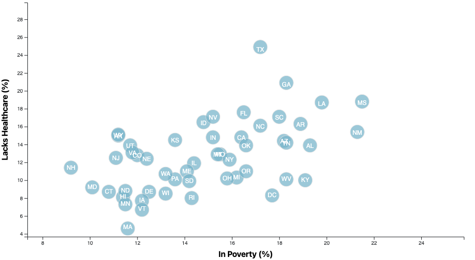
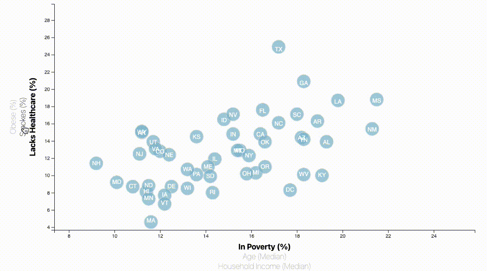

additional# D3 Project - Data Journalism and D3

## Background

The U.S. Census Bureau and the Behavioral Risk Factor Surveillance System are great sources of information about our nation, that can help us understand some current and future challenges, faced by our nation.

In this project, recent ACS 1-year (American Community Survey) estimates from 2014 are scrutinized - specifically data (`data.csv`) on rates of income, obesity, poverty, etc. by state. MOE stands for "margin of error."

By harnessing the power of JavaScript (specifically utilizing `d3.js`) I hope to uncover the health risks facing particular demographics of Americans, <b>by means of an interactive scatter plot</b>

### Before I Began

1. Created a new repository for this project called `D3-challenge`.

2. Cloned the new repository to my computer.

3. Inside the local git repository, I created a directory for the D3 challenge. Use the folder name to correspond to the project: **D3_data_journalism**.

4. This project utilizes both **html** and **Javascript** so be sure to add all the necessary files. With the `index.html` file being the framework to illustrate my findings.

## My Method

### My Core Objective: D3 Dabbler

I primarily created a `d3.js` scatter plot between two of the data variables. In this case I wanted to plot `Healthcare vs. Poverty`

Using the D3 techniques, I created a scatter plot that represents each U.S state with circle elements. I coded this graphic in the `app.js` file of my `d3-challenge repo`, by pulling in the data from `data.csv` by using the `d3.csv` function. The bi-product of this effort if the above image, which included -

* State abbreviations in the circles.

* Created and situated the axes and labels to the left and bottom of the chart.

* Testing / Run method: I utilized `python -m http.server` to run the visualization. This hosted on the page at `localhost:8000` in my web browser.

- - -

### Taking it a step further (plotting all variables interactively)

Rather than plotting several standalone charts in a Dashboard, as a method of comparison, I decided to harness the power of `d3.tip` to include all demographic and risk factors. I did this by -

#### 1. More Data, More Dynamics

* Placing additional labels in the scatter plot, that are interactive by means of `click events`, thus enabling a decision on which data to dynamically display. For enhanced aesthetics, the circles were implemented with animated transitions by taking the circles' locations and axes ranges.

#### 2. Incorporated d3-tip

Whist the ticks on the axes allow the user to infer approprimate values for each respective circle, it's near impossible to determine the true value without more required work. By using tooltips, I can reveal specific elements of data when the users cursor hovers over an element. I therefore added tooltips to the circles and displayed each tooltip with the data that the users selects.

Note: special thanks to [Justin Palmer](https://github.com/Caged) who's plugin (`d3-tip.js`) was utilized for this part of the project.
- - -
